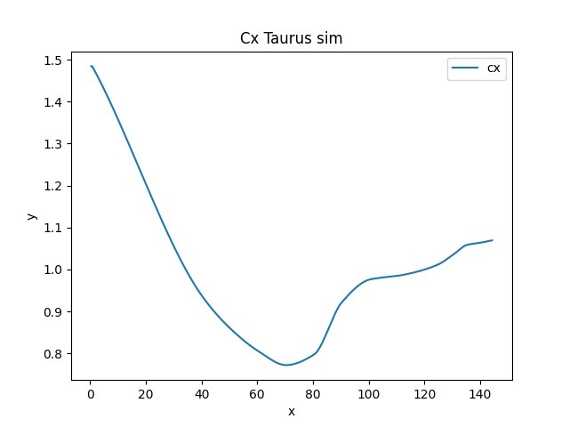

# Policumbent WHPSC Simulator
<!-- ALL-CONTRIBUTORS-BADGE:START - Do not remove or modify this section -->

<!-- ALL-CONTRIBUTORS-BADGE:END -->

Website of WHPSC Simulator [here](https://www.policumbent.it/whpsc-sim/).

## Technical explanation

### Simulation

The code solves an energy balance equation by considering an interval initial time t0 and end time t1, the equation is given by 
where on the right-hamd side:

-  is the kinetic’s energy difference.
-  the rider’s energy input.
-  potential energy difference generated by the road’s slope.
-  accounts for the dissipated energy by rolling resistance and air drag.

### Coefficients

Coefficients for rolling resistance (Cr) and drag resistance (Cd) are needed for the energy balance equation.
For the road bike Cr’s initial value at 0.1 m/s is taken as Cr = 0.005 (relatively smooth asphalt, mid-market 28’ tyres) and Cd = 0.68 at 15 m/s (see ‚CFD ‚analysis of an exceptional cyclist sprinter position‘, Blocken et al.). Slope for Cd is that for the recreational bike mentioned in ‚Bicycle ‚aereodynamics: an experimental evaluation methodology (Chowdhury, H., Alam, F.). Cr is varied according to our own data for a 28‘ tyre.
Cd’s value for the unfaired recumbent bike is taken basing on CdA = 0.18 at at 50 km/h (see The Recumbent Bicycle and Human Powered Vehicle Information Center) and Area = 0.2. An interpolation of this curve yields values for Cd at speeds different from 50 km/h. Cr stays unchanged with respect to the road bike.
Coefficients for Taurus are set with values similar to its estimated ones. Shape is maintained, but with respect to a different reference value at v=120 km/h, which is Cd(v=120 km/h) = 0.04. Cr's values are experimental values obtained. 

| Vehicle | Cd@120 km/h | Cr | Frontal Area (m²) |
| ------ | ------ | ------ | ------ |
|Road bike | 1.036*Cd(v=120km/h) at 0.1 m/s; slope = - 2.88*10^{-4} , yielding Cd = 1.0933 at 20 m/s   | 0.005 at 0,1 m/s;slope = + 3*10^{-6} every 0.1 m/s, yielding Cr = 0.0056 at 20 m/s    | 100 < h <= 165 => 0.34; 165 < h <= 175 => 0.38; 175 < h <= 185 => 0.43; 185 < h <= 200 => 0.48|
Unfaired recumbent bike |    same as above | same as above |  100 < h <= 165 => 0.26; 165 < h <= 175 => 0.29; 175 < h <= 185 => 0.32; 185 < h <= 200 => 0.36 |
Taurus | 1.4843*0.04 at 0.1 m/s; 1.0691*0.04 at 40 m/s | 0.0029 at 0.1 m/s;  0.0045 at 40 m/s |0.04 |

*Shape of cx curve of Taurus*

## How to use it

### Windows/MacOs/Chrome OS/Android

1. Go to [policumbent.it/whpsc-sim](https://www.policumbent.it/whpsc-sim/)
2. Connect your bluetooth powermeter. (This functionality is available only in Google Chrome 83+)
3. Start a new run

### Linux

1. How you can see [here](https://github.com/WebBluetoothCG/web-bluetooth/blob/gh-pages/implementation-status.md), Linux version of bluettoth API are partially implemented and not supported. So you need to enable `chrome://flags/#enable-experimental-web-platform-features`.
1. Go to [policumbent.it/whpsc-sim](https://www.policumbent.it/whpsc-sim/)
1. Connect your bluetooth powermeter. (This functionality is available only in Google Chrome 83+ and on linux may not work)
1. Start a new run

## Requirements

- **Android**: Requires Android 6.0 Marshmallow or later.
- **Mac**: Requires OS X Yosemite or later. (Some MacBooks may not work: Check "About this Mac" / "System Report" / "Bluetooth" and verify that Low Energy is supported.)
- **Linux**: Requires Kernel 3.19+ and BlueZ 5.41+ installed. Read How to get Chrome Web Bluetooth working on Linux.(Note that Bluetooth daemon needs to run with experimental interfaces if BlueZ version is lower than 5.43: sudo /usr/sbin/bluetoothd -E)
- **Windows**: Requires Windows 10 version 1706 (Creators Update) or later.

## License

[AGPL](https://github.com/policumbent/WHPSC-Sim/blob/master/LICENSE)

## Contributors ✨

Thanks goes to these wonderful people ([emoji key](https://allcontributors.org/docs/en/emoji-key)):

<!-- ALL-CONTRIBUTORS-LIST:START - Do not remove or modify this section -->
<!-- prettier-ignore-start -->
<!-- markdownlint-disable -->
<table>
  <tr>
    <td align="center"><a href="https://github.com/stelosca96"> <b>Stefano Loscalzo</b></a> <a href="https://github.com/policumbent/WHPSC-Sim/commits?author=stelosca96" title="Code">💻</a> <a href="#ideas-stelosca96" title="Ideas, Planning, & Feedback">🤔</a></td>
    <td align="center"><a href="https://github.com/FelAcke"> <b>FelAcke</b></a> <a href="https://github.com/policumbent/WHPSC-Sim/commits?author=FelAcke" title="Documentation">📖</a></td>
  </tr>
</table>

<!-- markdownlint-restore -->
<!-- prettier-ignore-end -->

<!-- ALL-CONTRIBUTORS-LIST:END -->

This project follows the [all-contributors](https://github.com/all-contributors/all-contributors) specification. Contributions of any kind welcome!